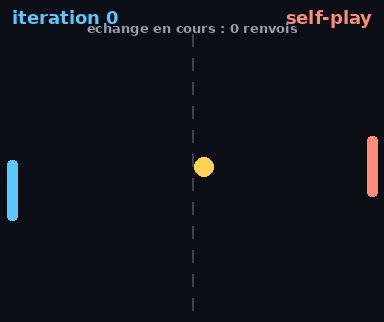
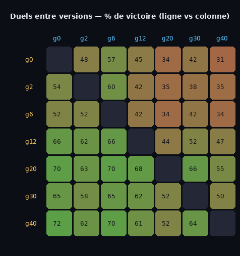

# 🧪 RL_Lab

Une collection de **petits projets de reinforcement learning**, simples et
surtout **très visuels** — le genre où on regarde l'ordinateur devenir bon au
fil des itérations, et où on fait s'affronter ses différentes versions.

Tout reste léger (numpy + Pillow, pas de GPU, pas de framework lourd) pour que
chaque projet soit lisible de bout en bout et s'entraîne en quelques minutes.

## Projets

| Projet | Description | Aperçu |
|--------|-------------|--------|
| [🏓 Pong](projects/pong/) | Un Pong qui apprend à jouer contre lui-même (self-play, Q-learning). On le regarde progresser et on fait s'affronter ses versions. |  |
| [🕵️ Agent Avenue](projects/agent_avenue/) | Le jeu de société *Agent Avenue* (mode simple) + un agent qui l'apprend en self-play (évolution). Courbe de progression et duels entre versions. |  |

## Démarrer

```bash
pip install -r requirements.txt
cd projects/pong
python train.py        # entraîne et sauvegarde des versions
python progression.py  # le GIF "regarde-le progresser"
python tournament.py 1000 20000   # un duel entre deux versions
```

## Structure

```
RL_Lab/
├── requirements.txt
└── projects/
    ├── pong/          # Pong self-play (Q-learning tabulaire)
    │   ├── env.py  agent.py  train.py  match.py
    │   ├── render.py  tournament.py  progression.py
    │   ├── checkpoints/   # versions entraînées (.npy)
    │   └── media/         # GIFs générés
    └── agent_avenue/  # le jeu Agent Avenue + agent appris (évolution self-play)
        ├── cards.py  env.py  policies.py  train.py  match.py
        ├── render.py  tournament.py  progression.py
        ├── checkpoints/   # vecteurs de poids par génération (.npy)
        └── media/         # courbe, matrice de duels, GIFs
```

Chaque nouveau projet vit dans son propre dossier sous `projects/`, autonome,
avec son README.
