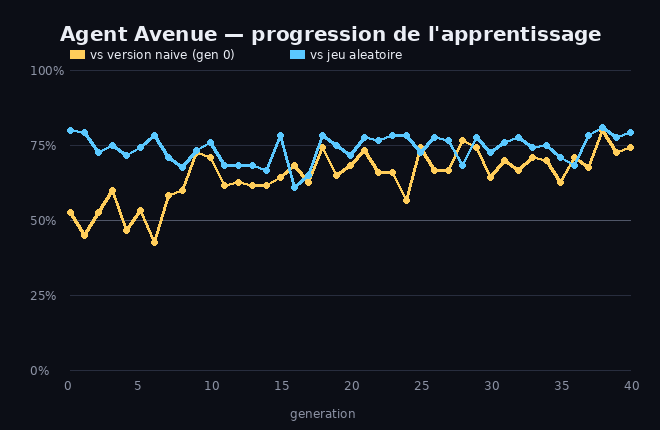
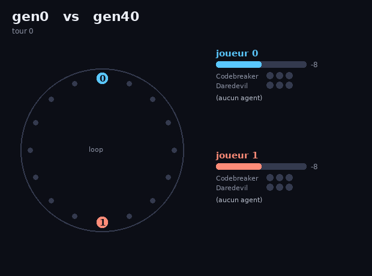

# 🕵️ Agent Avenue RL — un agent qui apprend le jeu en self-play

Implémentation du jeu de société **Agent Avenue** (mode simple) + un agent qui
apprend à y jouer **contre lui-même**, par évolution. On regarde sa progression
génération après génération, et on fait s'affronter ses différentes versions.

> Agent Avenue est un jeu 2 joueurs de bluff et de course-poursuite : on recrute
> des agents pour faire avancer son pion sur une boucle et **rattraper** le pion
> adverse. Voir [la fiche de règles](#règles-mode-simple) plus bas.

## Regarde-le apprendre

Taux de victoire du champion au fil des générations, contre sa version naïve
(génération 0) et contre un joueur aléatoire :



La ligne dorée part de ~50 % (aussi bon que sa version de départ) et grimpe vers
~70-75 % : il apprend à battre ses anciennes versions.

## Fais-les s'affronter

Matrice des duels entre tous les checkpoints (vert = la ligne bat la colonne) :


On voit le dégradé : les générations récentes (g20–g40) battent les anciennes.
À noter, un peu de **non-transitivité** (g20 tient tête à g40) — typique de la
coévolution, comme au pierre-feuille-ciseaux.

Et une partie filmée, gen 40 (bleu) contre gen 0 (rouge) :



## Comment ça marche

Le jeu a de l'**information cachée** (carte face cachée, main adverse) et un
espace d'actions plus riche que le Pong. L'approche reste simple :

- **`cards.py` / `env.py`** — le moteur fidèle du mode simple. Le plateau en
  boucle est modélisé par un seul scalaire : l'**écart** entre les deux pions.
  Le pion 0 rattrape le pion 1 quand l'écart tombe à 0 ; l'inverse quand il
  atteint la taille de la boucle. Les conditions *3 Codebreakers = victoire* et
  *3 Daredevils = défaite* sont gérées.
- **`policies.py`** — l'agent évalue chaque coup possible en le **simulant un
  coup à l'avance** avec le moteur, puis note l'état obtenu via une fonction de
  valeur linéaire `V = w · features` (avance dans la course, progression
  Codebreaker/Daredevil…). L'information cachée est gérée en **moyennant sur les
  cartes encore invisibles**. Les coups immédiatement gagnants/perdants sont
  toujours vus.
- **`train.py`** — entraînement par **évolution self-play** : on mute un vecteur
  de poids, on garde les meilleurs selon leur taux de victoire contre l'aléatoire
  + les anciens champions (coévolution).
- **`match.py`** — déroulé d'une partie entre deux politiques.
- **`render.py` / `progression.py` / `tournament.py`** — visualisations.

> Note : comme le lookahead voit déjà les coups gagnants/perdants, même des poids
> quelconques jouent correctement contre l'aléatoire. Le vrai progrès se mesure
> donc en **head-to-head contre la version naïve figée (gen 0)** — c'est la ligne
> dorée de la courbe.

## Lancer

```bash
pip install -r ../../requirements.txt

python train.py                  # entraine (~3 min), sauvegarde des checkpoints
python progression.py            # courbe d'apprentissage + matrice des duels
python tournament.py 0 40        # duel gen0 vs gen40 (score + GIF d'une partie)
```

## Règles (mode simple)

But : **rattraper le pion adverse** sur la boucle (ta position ≥ la sienne)
avant qu'il ne te rattrape. Chaque tour, l'actif joue **2 cartes** (1 visible,
1 cachée, noms différents) ; l'adversaire en **recrute 1**, l'actif prend
l'autre ; **chacun avance** selon la carte recrutée (le déplacement dépend du
nombre d'exemplaires de ce nom qu'on possède : 1 / 2 / 3+). Conditions de fin :
rattrapage, **3 Codebreakers** (victoire) ou **3 Daredevils** (défaite).

| Carte | ×6 sauf indiqué | 1 / 2 / 3+ copies |
|---|---|---|
| Double Agent | | −1 / +6 / −1 |
| Enforcer | | +1 / +2 / +3 |
| Sentinel | | 0 / +2 / +6 |
| Saboteur | | −1 / −1 / −2 |
| Codebreaker | | 0 / 0 / ✓ victoire |
| Daredevil | | +2 / +3 / ✗ défaite |
| Sidekick | ×1 | +4 |
| Mole | ×1 | −3 |

## Idées pour aller plus loin

- Gérer les **défausses** (4/partie) dans la stratégie de l'agent.
- Implémenter le **mode avancé** (cartes marché noir) et la **variante équipe**.
- Remplacer la fonction de valeur linéaire par un petit réseau, ou passer à du
  **Q-learning / self-play avec recherche** plus profonde.
- Modéliser finement le **bluff** (quelle carte cacher) plutôt que l'approximation
  « carte moyenne ».
