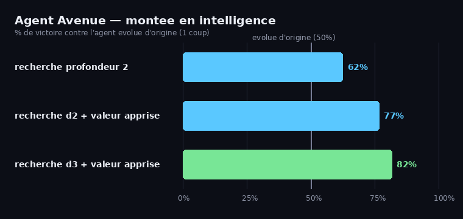
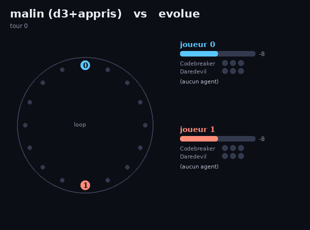

# 🕵️ Agent Avenue RL — un agent qui apprend le jeu en self-play

Implémentation du jeu de société **Agent Avenue** (mode simple) + un agent qui
apprend à y jouer **contre lui-même**, par évolution. On regarde sa progression
génération après génération, et on fait s'affronter ses différentes versions.

> Agent Avenue est un jeu 2 joueurs de bluff et de course-poursuite : on recrute
> des agents pour faire avancer son pion sur une boucle et **rattraper** le pion
> adverse. Voir [la fiche de règles](#règles-mode-simple) plus bas.

## Regarde-le apprendre

Taux de victoire du champion au fil des générations, contre sa version naïve
(génération 0) et contre un joueur aléatoire :


La ligne dorée part de ~50 % (aussi bon que sa version de départ) et grimpe vers
~70-75 % : il apprend à battre ses anciennes versions.

## Fais-les s'affronter

Matrice des duels entre tous les checkpoints (vert = la ligne bat la colonne) :


On voit le dégradé : les générations récentes (g20–g40) battent les anciennes.
À noter, un peu de **non-transitivité** (g20 tient tête à g40) — typique de la
coévolution, comme au pierre-feuille-ciseaux.

Et une partie filmée, gen 40 (bleu) contre gen 0 (rouge) :


## Aller plus loin — un agent plus intelligent

L'agent évolué ci-dessus ne regarde qu'**un coup** à l'avance avec une valeur
linéaire. On peut le rendre nettement plus fort de deux façons complémentaires :

1. **Recherche en profondeur** (`search.py`) — un minimax avec élagage
   alpha-bêta qui anticipe plusieurs tours. Comme le jeu a de l'information
   cachée, on utilise le **PIMC** (*Perfect Information Monte Carlo*) : on
   échantillonne plusieurs mains adverses plausibles, on résout un minimax
   parfait-information dans chacune, et on moyenne.
2. **Une valeur apprise par expert-iteration** (`train_value.py`, façon
   AlphaZero en miniature) — l'agent de recherche joue des parties (l'« expert »),
   on enregistre les états et qui gagne, puis on ajuste une fonction de valeur
   **enrichie** (`smart_value.py`) pour prédire l'issue. Une meilleure évaluation
   des feuilles rend la recherche plus forte à *toutes* les profondeurs.

Taux de victoire de chaque niveau **contre l'agent évolué d'origine** :



On grimpe de 50 % (référence) à **~82 %** : anticiper plus loin (recherche)
*et* mieux évaluer (valeur apprise) se cumulent. Au passage, l'expert-iteration
fait progresser la valeur à chaque tour (itération 1 bat la valeur d'origine à
74 %, itération 2 bat l'itération 1 à 60 %).

Le plus malin (recherche profondeur 3 + valeur apprise) contre l'évolué :



```bash
python train_value.py        # apprend la valeur enrichie (expert-iteration)
python intelligence.py       # graphe de comparaison + duel filme
```

## Comment ça marche

Le jeu a de l'**information cachée** (carte face cachée, main adverse) et un
espace d'actions plus riche que le Pong. L'approche reste simple :

- **`cards.py` / `env.py`** — le moteur fidèle du mode simple. Le plateau en
  boucle est modélisé par un seul scalaire : l'**écart** entre les deux pions.
  Le pion 0 rattrape le pion 1 quand l'écart tombe à 0 ; l'inverse quand il
  atteint la taille de la boucle. Les conditions *3 Codebreakers = victoire* et
  *3 Daredevils = défaite* sont gérées.
- **`policies.py`** — l'agent évalue chaque coup possible en le **simulant un
  coup à l'avance** avec le moteur, puis note l'état obtenu via une fonction de
  valeur linéaire `V = w · features` (avance dans la course, progression
  Codebreaker/Daredevil…). L'information cachée est gérée en **moyennant sur les
  cartes encore invisibles**. Les coups immédiatement gagnants/perdants sont
  toujours vus.
- **`train.py`** — entraînement par **évolution self-play** : on mute un vecteur
  de poids, on garde les meilleurs selon leur taux de victoire contre l'aléatoire
  + les anciens champions (coévolution).
- **`search.py`** — l'agent fort : minimax + alpha-bêta + PIMC (voir plus haut).
- **`smart_value.py` / `train_value.py`** — la valeur enrichie et son
  apprentissage par expert-iteration.
- **`match.py`** — déroulé d'une partie entre deux politiques.
- **`render.py` / `progression.py` / `tournament.py` / `intelligence.py`** —
  visualisations.
- **`play.py`** — **joue toi-même** contre un agent (voir ci-dessous).

> Note : comme le lookahead voit déjà les coups gagnants/perdants, même des poids
> quelconques jouent correctement contre l'aléatoire. Le vrai progrès se mesure
> donc en **head-to-head contre la version naïve figée (gen 0)** — c'est la ligne
> dorée de la courbe.

## Lancer

```bash
pip install -r ../../requirements.txt

python train.py                  # entraine (~3 min), sauvegarde des checkpoints
python progression.py            # courbe d'apprentissage + matrice des duels
python tournament.py 0 40        # duel gen0 vs gen40 (score + GIF d'une partie)
python train_value.py            # apprend la valeur enrichie (expert-iteration)
python intelligence.py           # graphe "montee en intelligence" + duel filme
```

## Joue toi-même contre un agent

```bash
python play.py                   # contre l'agent le plus malin (recherche + valeur apprise)
python play.py --opponent gen40  # contre une version evoluee precise
python play.py --opponent gen0   # contre la version naive (plus facile)
python play.py --first           # tu commences
```

Au terminal : tu vois le plateau, ta main, et tu choisis tes coups (quelles
cartes jouer, et quelle carte recruter quand l'agent joue). À la fin, ta partie
est enregistrée en GIF dans `media/ma_partie.gif`.

## Règles (mode simple)

But : **rattraper le pion adverse** sur la boucle (ta position ≥ la sienne)
avant qu'il ne te rattrape. Chaque tour, l'actif joue **2 cartes** (1 visible,
1 cachée, noms différents) ; l'adversaire en **recrute 1**, l'actif prend
l'autre ; **chacun avance** selon la carte recrutée (le déplacement dépend du
nombre d'exemplaires de ce nom qu'on possède : 1 / 2 / 3+). Conditions de fin :
rattrapage, **3 Codebreakers** (victoire) ou **3 Daredevils** (défaite).

| Carte | ×6 sauf indiqué | 1 / 2 / 3+ copies |
|---|---|---|
| Double Agent | | −1 / +6 / −1 |
| Enforcer | | +1 / +2 / +3 |
| Sentinel | | 0 / +2 / +6 |
| Saboteur | | −1 / −1 / −2 |
| Codebreaker | | 0 / 0 / ✓ victoire |
| Daredevil | | +2 / +3 / ✗ défaite |
| Sidekick | ×1 | +4 |
| Mole | ×1 | −3 |

## Idées pour aller plus loin

- ✅ ~~Recherche en profondeur~~ et ~~valeur apprise par expert-iteration~~ (faits).
- ✅ ~~Jouer soi-même contre un agent~~ (`play.py`).
- Gérer les **défausses** (4/partie) dans la stratégie des agents.
- Implémenter le **mode avancé** (cartes marché noir) et la **variante équipe**.
- Remplacer la valeur linéaire par un petit **réseau de neurones** (toujours en
  numpy) entraîné par expert-iteration.
- Modéliser finement le **bluff** (quelle carte cacher) plutôt que l'approximation
  PIMC « adversaire clairvoyant ».
