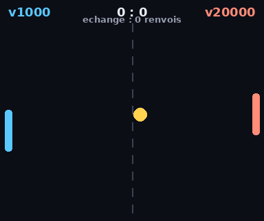

# 🏓 Pong RL — il apprend à jouer tout seul

Un Pong qui apprend à jouer **contre lui-même** (self-play), par Q-learning
tabulaire. Tout est en **numpy pur** : ça s'entraîne en ~2 minutes sur un CPU,
et on **voit** la progression sous forme de GIF.

## Regarde-le progresser

À 0 itération il rate la balle immédiatement. À 20 000 il tient des échanges
interminables. Chaque clip affiche le compteur d'itérations :


| itérations | échange moyen (renvois) |
|-----------:|:-----------------------:|
| 0          | 0.0 (rate tout)         |
| 200        | 1.6                     |
| 1 000      | 2.4                     |
| 5 000      | 3.2                     |
| 20 000     | **12.6**                |

## Fais-les s'affronter

On peut faire jouer n'importe quelle version contre une autre. Ici la jeune
version (gauche) se fait corriger par l'ancienne (droite) :



## Comment ça marche

- **`env.py`** — le terrain de Pong, sans écran. Balle continue, deux raquettes.
- **`agent.py`** — l'agent Q-learning. Astuce clé : **une seule table Q** est
  apprise du point de vue de la raquette de droite ; la gauche réutilise la même
  table en regardant le terrain **en miroir**. L'agent joue donc contre
  lui-même et chaque pas produit *deux* expériences → ça converge vite.
  L'état est encodé en un entier parmi 544 (position relative de la balle,
  distance, direction).
- **`train.py`** — boucle de self-play, récompense dense (+1 quand on renvoie,
  −1 quand on encaisse), sauvegarde des checkpoints.
- **`match.py`** — déroulé d'un match entre deux politiques.
- **`render.py`** — dessine les images et assemble le GIF (Pillow).
- **`tournament.py`** — duel entre deux versions, rendu en GIF.
- **`progression.py`** — le GIF « façon YouTube » qui enchaîne les versions.

## Lancer

```bash
pip install -r ../../requirements.txt

# 1) entraîner (sauvegarde des versions à 0, 200, 1000, 5000, 20000 manches)
python train.py
# ou un autre échéancier :
python train.py --checkpoints 0 1000 10000 100000

# 2) le GIF de progression
python progression.py

# 3) un duel entre deux versions
python tournament.py 1000 20000          # v1000 (gauche) vs v20000 (droite)
python tournament.py 5000 20000 --points 9
```

Les GIFs atterrissent dans `media/`, les versions entraînées dans
`checkpoints/`.

## Idées pour aller plus loin

- Un vrai **bracket de tournoi** entre toutes les versions (round-robin + classement).
- Remplacer la table par un **petit réseau** (toujours en numpy) pour un état continu.
- Ajouter de l'**effet/accélération** sur la balle et voir si la stratégie change.
